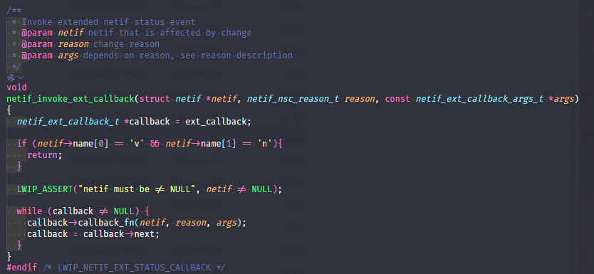
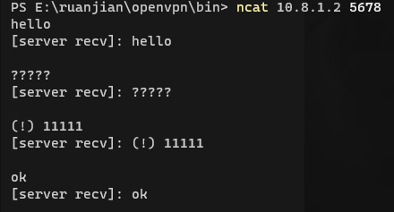

| Supported Targets | ESP32 | ESP32-C2 | ESP32-C3 | ESP32-C6 | ESP32-H2 | ESP32-P4 | ESP32-S2 | ESP32-S3 |
| ----------------- | ----- | -------- | -------- | -------- | -------- | -------- | -------- | -------- |

# pocketvpn-esp32s3-n16r8-helloworld

## 简述

该示例演示了一个基于pocketvpn的tcp通信。烧录后，开发板会主动连接`app_esp.h`上ip为`CONFIG_ESP_VPN_SERVER_IP`，端口号为`CONFIG_ESP_VPN_SERVER_PORT`的openvpn服务器。

连接成功后, 开发板会将`pocketvpn_tun`实例绑定于`lwip`的协议栈上。

之后，外部可访问开发板上的`CONFIG_ESP_APPLICATION_BIND_PORT`端口，实现tcp通信。

本项目采用的事esp32s3-n16r8开发板，但应该适用于其他esp32的项目中。

## 构建

1. 修改esp主文件夹下的`lwip/src/neitf.c`文件下的`netif_invoke_ext_callback`函数

由于esp32的项目对`lwip`的协议栈进行了挂钩，会导致非`esp`协议栈的`neitf`设备进行`neitf_add`函数调用时出现错误。

最简单的的解决办法是修改`Espressif\frameworks\esp-idf-v5.2.2\components\lwip\lwip\src\core\netif.c`文件夹下的`netif_invoke_ext_callback`函数，添加下列代码

```
    if (netif->name[0] == 'v' && netif->name[1] == 'n'){
    return;
    }
```



2. 设置较大的`TCP/IP`协议栈的栈空间大小

本项目要求较大的`TCP/IP`协议栈栈空间（本人设置为15k）默认的栈空间过小，会导致内存访问错误。


3. 根据需要修改`main/app_esp.h`与`main/pocketvpn_opt.h`文件

4. 根据esp32的官方文档进行编译，烧录。

## 效果图

